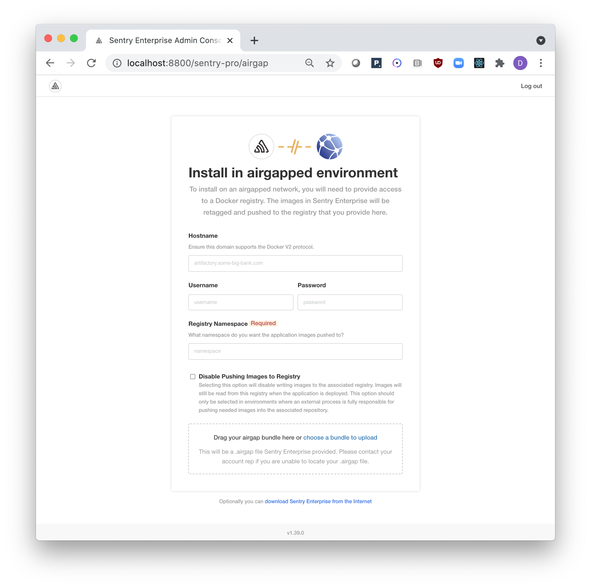

# Installing in an Air Gapped Environment

When installing an application with the Replicated app manager from a `.airgap` package, the container images and application manifests are provided by the application vendor in an archive that can be used to deliver the artifacts into the cluster.

This feature is only available for licenses that have the air gapped feature enabled.

This topic applies to installing the Replicated admin console into an existing Kubernetes cluster.  
For information about how to install on a cluster created by the Kubernetes installer in an air gapped environment, see [Install in an air gapped environment](installing-embedded-cluster#airgapped-installations) in _Installing with the Kubernetes installer_.

## Push Images and Install the Admin Console

You can install the admin console using the kots CLI plugin for the kubectl command-line tool. To install the admin console, you use the admin console binary bundle, `kotsadm.tar.gz`.

To push images and install the admin console:

1. Download `kotsadm.tar.gz` from the kots release page on GitHub. See [Releases](https://github.com/replicatedhq/kots/releases) in the kots GitHub repository.

1. Run the following command to confirm that the asset version matches the kots CLI version:

  ```shell
  kubectl kots version
  ```

1. Run the following command to extract admin console container images and push them into a private registry:

   ```shell
   kubectl kots admin-console push-images ./kotsadm.tar.gz private.registry.host/app-name \
     --registry-username RW-USERNAME \
     --registry-password RW-PASSWORD
   ```

   Where:

   * `RW-USERNAME` is the username for an account that has read and write access to the private image registry.

   * `RW-PASSWORD` is the password for the account with read and write access.
   :::note
   Replicated does not store or reuse these credentials.
   :::

1. Install the admin console using the images that you pushed in the previous step:

   ```shell
   kubectl kots install app-name \
     --kotsadm-namespace app-name \
     --kotsadm-registry private.registry.host \
     --registry-username RO-USERNAME \
     --registry-password RO-PASSWORD
   ```

   Where:
   * `RO-USERNAME` is the username for an account that has read-only access to the private image registry.
   * `RO-PASSWORD` is the password for the read-only account.
   :::note
   Replicated stores these read-only credentials in a Kubernetes secret in the same namespace where the admin console is installed.

   Replicated uses these credentials to pull the images. To allow Replicated to pull images, the credentials are automatically created as an imagePullSecret on all of the admin console Pods.
   :::

  After the `kots install` command completes, the app manager creates a port-forward to the admin console on port 8800. The admin console is exposed internally in the cluster and can only be accessed using a port forward.

  The port-forward is active as long as the CLI is running. You can press Ctrl+C to end the port forward.

  ```shell
    • Press Ctrl+C to exit
    • Go to http://localhost:8800 to access the Admin Console
  ```

1. Go to `http://localhost:8800` to complete the application setup in the admin console.

## Upload the Air Gap Bundle



The software vendor should have delivered an `.airgap` bundle to be used on this screen.
The bundle contains the container images and manifests.
Choose the bundle and click continue to start processing.


After the bundle has been completely uploaded, the admin console processes the images and manifests.
Images will be loaded, re-tagged, and pushed to the registry provided.


## Pass preflight checks

The app manager runs preflight checks (conformance tests) against the target namespace and cluster to ensure that the environment meets the minimum requirements to support the application.


### Resolve strict preflight checks

When one or more strict preflight checks are present, the application deployment is blocked until these strict checks are run. Strict preflight checks must not contain failures and block the release from being deployed until the failures are resolved. Strict preflight checks help enforce that vendor-specific requirements are met before the application is deployed.

### Resolve role-based access control checks

When the installation uses [minimal role-based access control (RBAC)](../reference/custom-resource-application#requireminimalrbacprivileges), the app manager recognizes if the preflight checks failed due to insufficient privileges.


When this occurs, a `kubectl preflight` command is displayed that you must run manually in the cluster to run the preflight checks. When the command runs and completes, the results are automatically uploaded to the app manager.

**Example:**

```bash
curl https://krew.sh/preflight | bash
kubectl preflight secret/<namespace>/kotsadm-<appslug>-preflight
```
