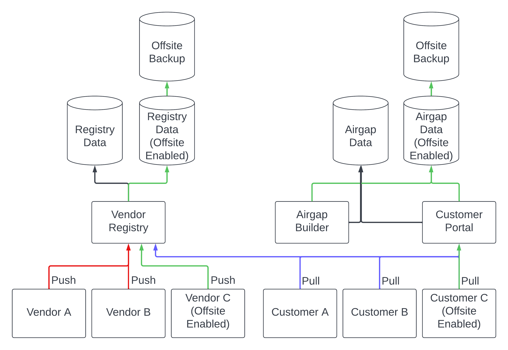

# Offsite Data Backup Add-on

:::note
The offsite data backup add-on has limited availability.
:::

Replicated stores customer data in multiple databases across Amazon Web
Services (AWS) S3 buckets. Clustering and network redundancies help to avoid a
single point of failure.

The offsite data backup add-on provides additional redundancy by copying data to
an offsite Google Cloud Provider (GCP) storage location. This helps to avoid
any data loss caused by an outage to AWS.

## Overview

When the offsite data backup add-on is enabled, data is migrated to
enterprise AWS S3 buckets that are backed up to offsite storage locations in GCP.
After data is migrated from existing S3 buckets to the enterprise buckets,
all data is deleted from the previous S3 buckets.

To ensure customer data in the offsite GCP storage remains up-to-date, the GCP
account uses the Google Storage Transfer service to sync at least daily with the
enterprise S3 buckets.

The offsite GCP backups function only as data storage and do not serve customer
data. In the case of an AWS outage, Replicated can use a manual
process to restore customer data from the backups into a production-grade database.

For more information, see [Architecture](#architecture) below.

## Enabling Offsite Data Backup

:::note
The offsite data backup add-on has limited availability.
:::

To request offsite data backup, contact [INSERT CONTACT].

## Architecture

The following diagram shows the flow of air gap build data and registry image data
when the offsite data backup add-on is enabled. The flow of data that is backed
up offsite is depicted with green arrows.

[View a larger version of this image](../../static/images/offsite-backup.png)

As shown in the diagram above, when the offsite data backup add-on is enabled,
registry and air gap data are stored in separate enterprise S3 buckets. Both of
these enterprise S3 buckets back up data to offsite storage in GCP.

The diagram also shows how customer installations continue to pull data from the
vendor registry and the customer portal when offsite data backup is enabled. The
offsite storage does not serve data to customers.
